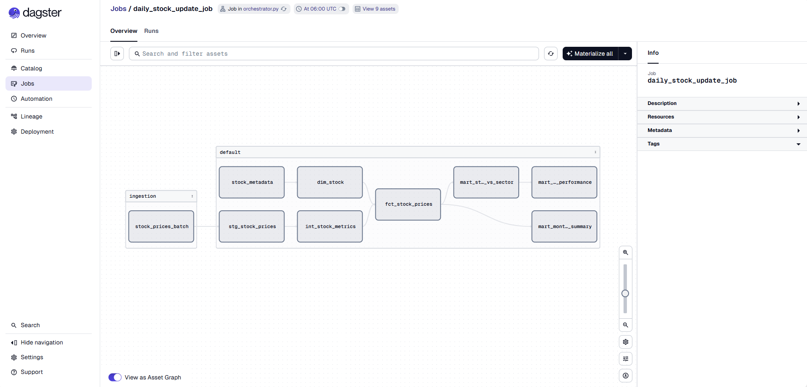
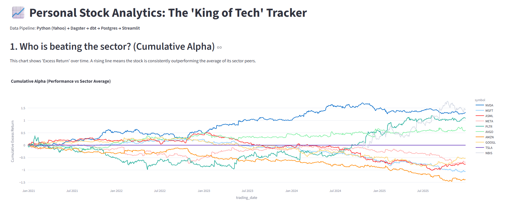
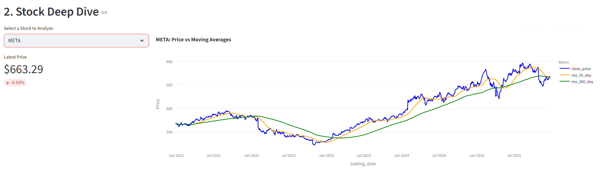
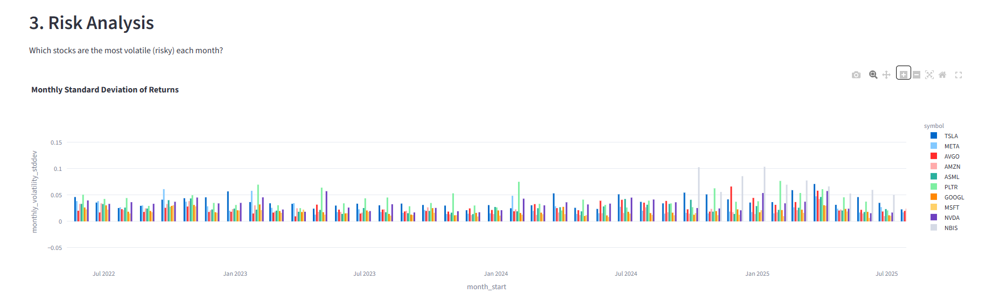

# 📈 Stock Analyzer (End-to-End Data Engineering)

A data pipeline that extracts stock market data, transforms it using modern analytics engineering practices, and visualizes "Alpha" (excess returns) against sector peers.

## 🏗️ Architecture

**Yahoo Finance API** (Extract) → **Python** (Load) → **Postgres** (Storage) → **dbt** (Transform) → **Dagster** (Orchestrate) → **Streamlit** (Visualize)

## 🚀 Key Features

*   **Self-Healing Pipeline:** Orchestrated via **Dagster**, ensuring Python extraction scripts run successfully before dbt transformations begin.
*   **Modern Data Stack:** Utilizes **dbt Core** for modular SQL modeling (Staging → Intermediate → Marts).
*   **Dynamic Extraction:** Python script fetches 5 years of historical data for dynamic ticker lists and handles schema changes (Drop/Cascade) automatically.
*   **Analytics:** Calculates complex metrics like **Moving Averages**, **Volatility**, and **Cumulative Alpha** to identify stocks outperforming their sector.

## 🛠️ Tech

*   **Language:** Python 3.12, SQL
*   **Orchestration:** Dagster
*   **Transformation:** dbt
*   **Database:** PostgreSQL
*   **Visualization:** Streamlit, Plotly
*   **Libraries:** yfinance, pandas, sqlalchemy

## 📊 Visuals

### 1. Orchestration Lineage
*Demonstrates the dependency graph between the raw Python ingestion layer and the dbt transformation layer.*



### 2. Analytics Dashboard
*Interactive Streamlit dashboard visualizing 5 years of stock performance.*

**A. Cumulative Alpha (The "King of Tech")**
*Tracks how much a stock is outperforming (or underperforming) the sector average over time. A rising line indicates the stock is generating "Alpha".*


**B. Stock Deep Dive**
*Individual stock analysis comparing daily price against 50-day and 200-day Moving Averages to identify trends.*


**C. Risk Analysis**
*Monthly volatility breakdown (Standard Deviation) to assess which stocks carried the most risk during specific periods.*


## ⚙️ How to Run

1.  **Install Dependencies:**
    ```bash
    pip install -r requirements.txt
    ```

2.  **Configure Credentials:**
    Update database connections in `python_scripts/fetch_stock_data.py` and `dbt_project.yml`.

3.  **Run the Pipeline (Dagster):**
    ```bash
    dagster dev -f orchestrator.py
    ```

4.  **Launch Dashboard:**
    ```bash
    python -m streamlit run dashboard.py
    ```